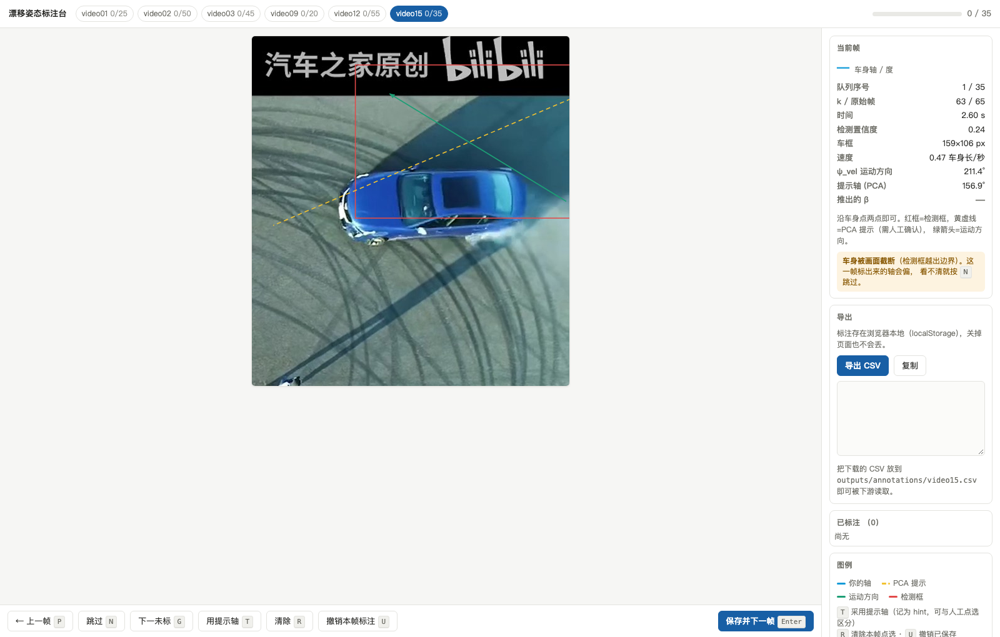

# 赛车漂移姿态识别 Demo

通过固定俯视视角记录赛车漂移，用计算机视觉找到车辆、判断运动方向，并推算滑移角。
本项目当前处于 **M1 阶段**：预处理 + 双分支车辆检测 + 运动方向（ψ_vel），
**不需要任何人工标注**即可跑出速度与航向曲线。完整规划见 [`项目规划.md`](项目规划.md)。

---

## 快速开始

环境：Python 3.11（conda env `racing-pose`），依赖 `opencv-python`、`numpy`、`matplotlib`、`scipy`。

```bash
cd demo02

# ① 跑主线素材（登记的静止机位、未搁置）：预处理 + 检测 + 运动方向
python -m src.pipeline --all-static
python -m src.pipeline --videos video02 video12 video15      # 指定素材
python -m src.pipeline --videos video02 --stage preprocess --force   # 只跑某一阶段 / 忽略缓存

# ② 生成待标注队列（按朝向多样性挑帧，并预渲染裁图）
python -m src.select_frames --all
python -m src.select_frames --videos video02 --budget 20     # 覆盖默认配额

# ③ 标注车身轴（浏览器里点两下）
python -m src.annotate --serve                               # 边点边存，直接落盘
python -m src.annotate --serve --name video02
python -m src.annotate --export --all                        # 或导出离线自包含 HTML
python -m src.annotate --status                              # 只看进度与一致性体检
```

### 产物

| 路径 | 内容 |
|---|---|
| `outputs/preprocess/<名>.json` | 预处理结果（黑边、去重帧号、重建时间轴、背景可用性） |
| `outputs/tracks/<名>.csv` | 逐帧运动学序列（位置、速度、ψ_vel、β 等），标注也用这个文件的帧号 |
| `outputs/plots/<名>_kinematics.png` | 轨迹 / 速度 / 航向 / 滑移角 四联图 |
| `outputs/plots/<名>_detect_check.png` | 检测抽帧目检图（红框=检测框，绿点=质心，黄线=掩膜主轴） |
| `outputs/plots/<名>_annot_queue.png` | 待标注队列预览（含选帧前后的朝向覆盖对比） |
| `outputs/reports/M1_报告.md` | 汇总报告（含与 geo-trax 的交叉校验） |
| `outputs/annotations/queue/<名>.csv` | 待标注帧队列（选帧结果） |
| `outputs/annotations/<名>.csv` | **人工标注的车身轴**，格式见 `outputs/annotations/README.md` |
| `outputs/annotations/web/<名>.html` | 离线版标注台（自包含，图片内嵌） |

---

## 代码结构

```
src/
  config.py         素材登记表（15 段素材的相机性质、检测分支、裁剪参数、来源分组、标注配额）
  preprocess.py     黑边检测与裁剪、重复帧剔除、时间轴重建、背景模型可用性判定
  detect.py         双分支检测（静止机位背景建模 / 相机运动读 geo-trax）+ 时序过滤
  crops.py          待标注裁图的渲染与"显示↔工作图"坐标换算
  select_frames.py  待标注帧选择（贪心最远点采样）+ 队列预览图
  annotate.py       标注台（浏览器点两下 / 导出自包含 HTML）+ 标注 CSV 读写
  kinematics.py     轨迹平滑、速度、航向 ψ_vel、滑移角 β、人工标注接口
  pipeline.py       命令行入口，串起上面三层并出图出报告
```

设计要点都写在对应模块的 docstring 里，下面只列最容易踩的几条。

---

## 五个关键约定（改代码前务必先读）

### 1. 角度约定

图像 x 轴向右为 `0°`，**顺时针为正**，范围 `[0, 360)`。
因为图像 y 轴向下，`atan2(dy, dx)` 天然就是"顺时针为正"，不需要翻转符号。
滑移角 `β = ψ_body − ψ_vel`，顺时针为正（沿用 demo01 的约定）。

### 2. 只需标注"车身轴"，不需要区分车头车尾

`ψ_body` 是**无向量**（模 180°）。漂移时恒有 `|β| < 90°`，所以程序会自动取
"与运动方向夹角 ≤ 90°"的那一端作为车头 —— 180° 歧义自动消解。
标注时每帧只点一条轴线即可，标注量比"标车头朝向"少一半以上。

### 3. 重复帧判据是像素级的，不是均值级的

判据：相邻帧缩到 480×270 灰度后，`|diff| > 20` 的像素占比小于 `0.05%` 即判为重复帧。
**不要退回到"平均绝对差 < 0.5"**：车身很小时那个判据会把缓慢运动误判成重复帧
（实测 video07 被高估到 95.2%，真值 9.5%）。详见 `项目规划.md` §13.1。

### 4. 相机静止性看"背景残留"，不看帧间配准位移

相位相关在低对比度/重复纹理地面（如 video12 的碎石地）上会多峰失锁；
ORB + RANSAC 在同一类画面上内点率也会掉到 24%~35%。两者都不可靠。

因此判据是**直接检验问题本身**：建中值背景 → 逐帧差分 → 扣掉最大连通域（车辆）
→ 剩余差异像素占比。超过 `BG_RESIDUAL_MAX`（默认 3%）即认为背景模型不成立。
实测与人工目视判断完全一致。

### 5. 坐标系有三套，别混

| 坐标系 | 说明 |
|---|---|
| **原图** | 视频原始分辨率（如 1920×1080），geo-trax 的 txt 用这个 |
| **ROI** | 裁掉黑边之后的图 |
| **工作图** | ROI 再缩放（宽度 = 原图一半，限幅 640~1352），检测与坐标输出都用这个 |

换算用 `preprocess.work_scale / work_to_orig / orig_to_work`。
**在诊断图上画框最容易在这里出错**：用工作图坐标去画原图，框会偏到一半的位置。

---

## 双分支检测

| 分支 | 适用 | 做法 |
|---|---|---|
| `bgsub` | 相机静止 | 中值背景（滚动窗口）+ 帧差 + 形态学 + 连通域 |
| `geotrax` | 相机运动 | 读 `drift/results/<名>.txt`（检测+跟踪模型输出） |

`bgsub` 分支的三处非平凡设计：

1. **滚动背景**：每 `BG_BLOCK` 帧重建一次，用前后各 `BG_WINDOW` 帧求中值。
   这样即使相机缓慢漂移（video12 约 23 px）也能保住背景清晰度，
   不必整段共用一个背景。
2. **按"差异能量"选目标**（面积 × 平均差异），不是取最大面积。
   画面里的字幕带、反光带面积可以很大但差异弱，纯按面积会选错。
3. **筛掉细长结构**：长宽比上限 `MAX_ASPECT = 6`，
   字幕带的长宽比实测可达 13:1。

已知局限（M1 未解决，见报告）：车身**阴影**会与车身连成同一个连通域，
把框撑大并让质心偏向阴影一侧。目前用"按差异强度加权的质心"压制，
但没有根治。

---

## 标注：为什么是"选帧 + 点两下"

### 选帧不是随机抽的

`select_frames.py` 用**贪心最远点采样**挑帧，特征四项拼接：

| 特征 | 权重 | 意图 |
|---|---|---|
| 朝向代理 `[cos2θ, sin2θ]` | 1.00 | 朝向覆盖第一 |
| 画面位置 `[cx/W, cy/H]` | 0.70 | 别把帧都堆在轨迹同一处 |
| 时间 `t/T` | 0.80 | 覆盖整段时长 |
| 外观 `48×48` 归一化灰度 | 0.60 | 避开几乎一样的画面 |

每轮选出"与已选集合最小距离"最大的候选。效果见
`outputs/plots/<名>_annot_queue.png` 顶部的直方图：默认候选的朝向分布有尖峰，
选完之后明显被拉平。四条门槛用来避免浪费标注额度：置信度过低、车框过小、
位置被判离群、车框贴边的帧都不入选。

### 点两下的原理与实现

标注台（`annotate.py`）在浏览器里把某一帧裁到车辆周围并放大，你**沿车身点两个点**。
角度是**换算回工作图坐标之后**才算的，因为裁图在两个方向上的缩放比不严格相等，
直接在显示坐标里算会引入一点各向异性误差。



界面上的绿箭头（运动方向 ψ_vel）是给你判断车头朝哪边用的参考；
`T` 键可一键采用 PCA 提示轴，但它会记为 `src=hint`，与人工点选的
`src=manual` 分开存档 —— 都是人工确认的结果，但审计时要能区分。

车身被画面截断的帧会在侧栏给出警示（检测框越出边界，标出来的轴会偏），
看不清就按 `N` 跳过。

两种模式各有取舍：

| 模式 | 保存方式 | 适用 |
|---|---|---|
| `--serve` | 每标一帧 POST 落盘到 `outputs/annotations/<名>.csv` | 推荐，不手工搬文件 |
| `--export` | 标完点"导出 CSV"下载，再放到 `outputs/annotations/` | 离线、或想换个环境标 |

`--export` 的页面把既有标注一起嵌进载荷，再叠加 localStorage 里的本地改动 ——
所以重新导出不会丢掉之前标的帧。

---

## 当前进度与下一步

已完成：

- [x] M1 预处理：黑边、去重、时间轴重建、背景可用性判定
- [x] M1 双分支检测，且与 geo-trax 交叉校验一致（video02 IoU 中位约 0.88~0.91）
- [x] M1 运动方向 ψ_vel、速度曲线、目检图、汇总报告
- [x] 标注链路：选帧（朝向多样性）+ 标注台（浏览器点两下）+ 标注 CSV 读写
- [x] 各素材待标注队列已生成（合计约 230 帧，见 `src/config.py` 的 `ANNOT_QUOTA`）

下一步：

- [ ] **人工标注车身轴**（L4，项目最大难点）—— 队列与标注台已就绪，等标注结果
- [ ] 标完之后重跑 `pipeline`，得到完整的 β 曲线（现在 β 用的是 PCA 基线，不可用）
- [ ] 比例尺标定：用地面已知尺寸（video03 的靶心圆、video13/14 的轮胎痕圆环）
      把 px/s 换算成 m/s
- [ ] 滑移角 β 的精度评估与盲标误差分析
- [ ] 相机运动场景（video10/11）的检测能力验证

## 素材

`drift/` 下的视频**不入 git**（约 385 MB，见 `.gitignore`）。
素材清单、体检结论、可用性与推荐用途见 [`项目规划.md`](项目规划.md) §13。
