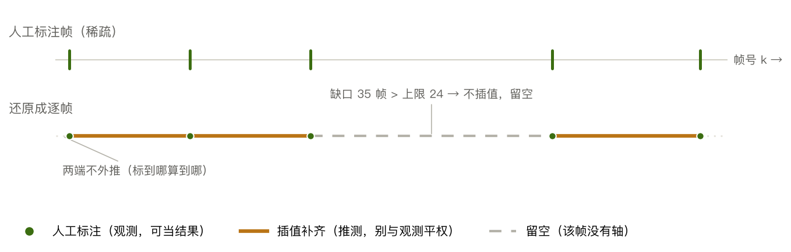
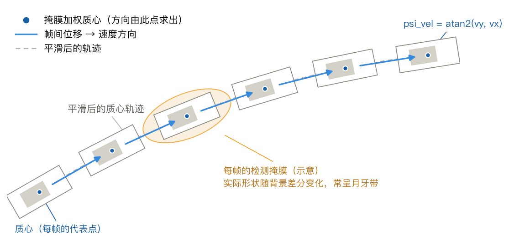
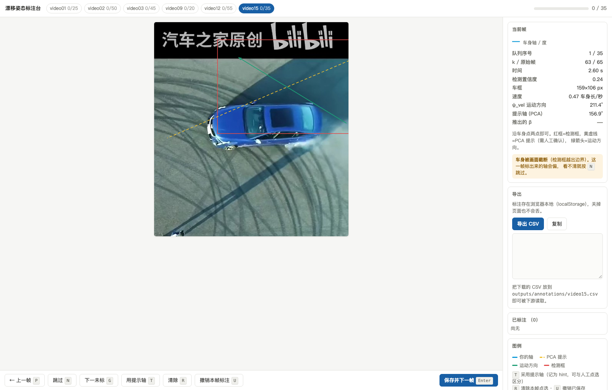

# 赛车漂移姿态识别 Demo

通过固定俯视视角记录赛车漂移，用计算机视觉找到车辆、判断运动方向，并推算滑移角。
本项目当前处于 **M1 阶段**：预处理 + 双分支车辆检测 + 运动方向（ψ_vel），
**不需要任何人工标注**即可跑出速度与航向曲线。完整规划见 [`项目规划.md`](项目规划.md)。

---

## 这套系统在算什么（先读这一节）

一句话：**输入一段固定俯视的漂移视频，输出逐帧的车身朝向、运动方向与滑移角。**
这一节只回答"输出的曲线和叠加视频里，那些线和颜色分别是什么意思"；
具体的工程规则与踩过的坑在后面《十五个关键约定》里。

### 三个量

| 符号 | 名字 | 是什么 | 怎么来 |
|---|---|---|---|
| `ψ_body` | 车身朝向 | 车的**轴线**朝哪边。无向（模 180°），本身分不出车头车尾 | 人工标注（每帧点一条轴线），其余帧插值补齐 |
| `ψ_vel` | 运动方向 | 车**往哪个方向移动**。有向 | 检测轨迹的时间导数 |
| `β` | 滑移角 | `β = ψ_body − ψ_vel`，顺时针为正 | 上面两个相减 |

漂移的本质就是这两个方向不一致：车身指着一边，车却往另一边滑，夹角就是 β。
注意**车头是由运动方向推出来的**（取与 `ψ_vel` 夹角 ≤ 90° 的那一端），不是直接观测的量
—— 所以 |β| 被结构性地夹在 ±90°，逼近 90° 时"哪端是车头"等于抛硬币（见约定 2、约定 11）。

### 一帧画面上有哪几样东西

`outputs/overlays/<名>_pose.mp4`（交付物 D7）把全部信息画回原画面：

| 画面元素 | 含义 |
|---|---|
| **彩色直线** | 车身轴。**颜色表示"这条轴哪来的"，不是装饰** —— 见下一节 |
| 蓝色箭头 | 运动方向 `ψ_vel` |
| 灰色方框 | 检测框（轴对齐） |
| 左上角面板 | 当前帧的 β / ψ_body / ψ_vel / 速度 / 轴来源 |
| 底部时序带 | 整段的 β 曲线 + 当前帧游标，刻度**固定 ±90°** |

它同时是**验收工具**：曲线图看不出"这一帧的车头到底朝哪边"，只有把轴画回车身上才看得出来。

### 车身轴的四种来源 —— 颜色就是可信度



| 颜色 | `axis_src` | 含义 | 可信度 |
|---|---|---|---|
| 绿 | `annotated` | 人工在标注台点的 | **观测**，可当结果 |
| 橙 | `interp` | 两个已标帧之间插出来的 | **假设**，别与观测平权 |
| 红 | `pca` | 掩膜 PCA 主轴，机器自己猜的 | **不是结果**，仅作参考 |
| 灰 | `none` | 该帧没有轴 | — |

同一件事在 `outputs/tracks/<名>.csv` 里就是 `axis_src` 列（见约定 6）。

#### 橙色插值是什么

人工标注是**抽着标**的：一段素材标几十帧，不必每帧都点。因为稳态漂移下车身轴的
角速度近似恒定，中间帧可以按时间比例补出来。补的规矩有三条：

- 只在两个**已标帧之间**插，**两端不外推**（标到哪算到哪）；
- 缺口超过 `ANNOT_MAX_GAP`（24 帧）就**不插**，留空 —— 间隔太远时"匀速转动"的假设不成立；
- 用**倍角法**插（角度先翻倍、插完再折回），否则 0°/180° 的接缝会被插成"转了半圈"。

所以橙色帧是**推测**而非观测，图上必须与绿色分开画。

#### PCA 基线是什么

PCA（主成分分析）在这里的用法很直白：**把掩膜里的像素当成一堆散落的点，
找出这堆点"铺得最开"的方向**（数学上是协方差矩阵的最大特征向量），再用 `atan2`
换算成角度（`detect.py` 的 `cv2.PCACompute`）。车是细长的，所以这个方向通常是车身纵向。

它不需要任何人工标注、每帧都能算，所以叫"基线"：用来当兜底、当标注台里的提示线。
但它**不是结果**，因为掩膜并不是车身轮廓：

- 背景建模拿到的掩膜其实是「**车辆移动扫过的月牙形变化带**」。在月牙上做 PCA，主轴是
  "车身轴 + 运动方向"的混合物，系统性偏 **7°** 左右；video15 因为地面暗带被并进掩膜，
  偏到 **约 30°**，且**不是常数偏移**，减不掉（见《项目规划.md》§14.7、§14.11）。
- PCA **不区分主轴与次轴**，偶尔把次轴当主轴，让一段轴整体转 **90°**（video03 实测）。
  这类分支翻转**没有任何自动方法能定下该翻哪一段**，只能交给人工（见约定 10）。

### 运动方向是怎么判断的，基点在哪



**不做特征点跟踪** —— 不跟轮子、不跟车灯、不跟某个角点。做法是把"一整块区域"压成
**每帧一个代表点**：检测掩膜的**加权质心**（权重是该像素与背景的差异强度；用加权而非
简单平均，是为了让阴影这类弱差异拉不动它）。

于是每帧有一个点、整段有一条轨迹，再依次做三件事：

1. 剔离群点（与滑动中值偏离过大的帧置空）；
2. 补齐内部缺口（同样两端不外推）；
3. Savitzky-Golay 平滑。

方向就是对这条平滑轨迹做**帧间差分**：`(vx, vy) = 相邻帧位置之差 / Δt`，
`ψ_vel = atan2(vy, vx)`。角度约定：图像 x 轴向右为 0°、**顺时针为正**（见约定 1）。
速度低于 `SPEED_MIN_PXS`（3 px/s）时方向无定义，置空。

**所以基点是每帧掩膜的质心**，不是车头、不是检测框中心、不是某个车轮。

这也正是它最脆弱的地方：**质心是把一整块区域压成一个点的代价**。凡是能往掩膜里
"塞私货"的东西（车尾水雾尾迹、地面阴影、画面边缘把车截断）都会把质心拽偏，方向跟着偏；
而位置曲线看上去仍然平滑漂亮 —— 平滑只保证连续，不保证正确（约定 13）。两条实证：

- **video15 开头 k=1~14**：质心被车后水雾尾迹拖偏 **11~90 px**，对 β 影响约 8°。
- **video12**：反方向的失效 —— 车移动慢 + 质心抖，帧间位移与检测噪声同量级，
  **38/55 个标注帧的位移信噪比 < 3**，运动方向本身没有信息量，β 等于减去一个随机数
  （约定 14）。该素材因此**搁置**，而不是硬跑一条好看的曲线交上去。

### 读图时该信什么

- **车身轴**：绿=观测、橙=推测、红=机器猜。颜色即可信度。
- **运动方向**：先看报告 §4 的「运动方向可信」列；信噪比不够，它就是噪声。
- **车头朝向**：是推出来的，|β| 越接近 90° 越不可信，顶到 ±90° 等于抛硬币（约定 11）。
- **精度数字**：**只能来自盲标**（约定 15），不能用参与调参的数据自证。

---

## 快速开始

环境：Python 3.11（conda env `racing-pose`），依赖 `opencv-python`、`numpy`、`matplotlib`、`scipy`。

```bash
cd demo02

# ① 跑主线素材（登记的静止机位、未搁置）：预处理 + 检测 + 运动方向
python -m src.pipeline --all-static
python -m src.pipeline --videos video02 video12 video15      # 指定素材
python -m src.pipeline --videos video02 --stage preprocess --force   # 只跑某一阶段 / 忽略缓存

# ② 生成待标注队列（按朝向多样性挑帧，并预渲染裁图）
python -m src.select_frames --all
python -m src.select_frames --videos video02 --budget 20     # 覆盖默认配额

# ③ 标注车身轴（浏览器里点两下）
python -m src.annotate --serve                               # 边点边存，直接落盘
python -m src.annotate --serve --name video02
python -m src.annotate --export --all                        # 或导出离线自包含 HTML
python -m src.annotate --status                              # 只看进度与一致性体检
```

### 产物

| 路径 | 内容 |
|---|---|
| `outputs/preprocess/<名>.json` | 预处理结果（黑边、去重帧号、重建时间轴、背景可用性） |
| `outputs/tracks/<名>.csv` | 逐帧运动学序列（位置、速度、ψ_vel、β 等），标注也用这个文件的帧号 |
| `outputs/plots/<名>_kinematics.png` | 轨迹 / 速度 / 航向 / 滑移角 四联图 |
| `outputs/plots/<名>_detect_check.png` | 检测抽帧目检图（红框=检测框，绿点=质心，黄线=掩膜主轴） |
| `outputs/plots/<名>_annot_queue.png` | 待标注队列预览（含选帧前后的朝向覆盖对比） |
| `outputs/overlays/<名>_pose.mp4` | **姿态叠加视频**（交付物 D7）：把车身轴、运动方向、β 画回画面；轴的颜色即来源 |
| `outputs/reports/M1_报告.md` | 汇总报告（含与 geo-trax 的交叉校验） |
| `outputs/reports/D8_盲标精度.md` | 盲标精度报告（独立测试集，见约定 15） |
| `outputs/reports/M1_报告_局部.md` | 只跑部分素材时的报告（避免局部运行覆盖全量报告） |
| `outputs/annotations/queue/<名>.csv` | 待标注帧队列（选帧结果） |
| `outputs/annotations/<名>.csv` | **人工标注的车身轴**，格式见 `outputs/annotations/README.md` |
| `outputs/annotations/blind/queue/<名>.csv` | 盲标抽检队列（独立测试集；提示与运动方向列**留空**） |
| `outputs/annotations/blind/labels_<名>.csv` | 盲标结果（**与训练标注分开存**，不参与调参） |
| `outputs/annotations/web/<名>.html` | 离线版标注台（自包含，图片内嵌） |

---

## 代码结构

```
src/
  config.py         素材登记表（15 段素材的相机性质、检测分支、裁剪参数、来源分组、标注配额）
  preprocess.py     黑边检测与裁剪、重复帧剔除、时间轴重建、背景模型可用性判定
  detect.py         双分支检测（静止机位背景建模 / 相机运动读 geo-trax）+ 时序过滤
                    （带 `debug=` 诊断钩子：按 k 存下确切的掩膜与差异权重图。
                      位置污染类问题必须看着掩膜才能定论，见约定 13；默认 None，零开销）
  crops.py          待标注裁图的渲染与"显示↔工作图"坐标换算
  select_frames.py  待标注帧选择（贪心最远点采样）+ 队列预览图
  annotate.py       标注台（浏览器点两下 / 导出自包含 HTML）+ 标注 CSV 读写
  kinematics.py     轨迹平滑、速度、航向 ψ_vel、滑移角 β、人工标注接口
  overlay.py        姿态叠加视频：把车身轴/运动方向/β 画回画面（交付物 D7，也是验收工具）
  qa_pose.py        姿态质量审计的判据本体（报告 §4 与 tools/qa_pose.py 共用）
  blind.py          盲标抽检：抽帧规则 + 评分本体（独立测试集，见约定 15）
  pipeline.py       命令行入口，串起上面三层并出图出报告出叠加视频
tools/
  probe_shadow.py            5 种"在掩膜里压阴影"的变体 vs 人工标注（见 §14.7）
  probe_color_axis.py        月牙掩膜 / 颜色轮廓 / 颜色+凸包 三种轴来源的精度对照
  probe_shadow_view.py       把掩膜、PCA 轴、人工轴画在一起，用于肉眼找根因
  probe_axis_by_material.py  各素材"轮廓轴 vs 月牙轴"的无人监督筛查，用来排标注优先级
  probe_contour_axis.py      通用轮廓轴（与车色无关）对人工真值的验收（见 §14.7.1、§14.9）
  probe_axis_view.py         把检测框/分割掩膜/三种轴画在一起，肉眼找分割病灶（见 §14.9）
  probe_axis_branch.py       90° 分支翻转诊断；带轮廓锚定的 DP 变体已验证（见 §14.10）
  probe_tape_match.py        素材溯源：某段素材是从哪个母带剪的（见 §14.8）
  qa_pose.py                 姿态质量审计：标注的物理可信度 + β 边界饱和度 + 运动方向信噪比
  show_trajectory.py         把检测轨迹叠在工作图上，区分"孤立尖刺"与"平滑偏移"（见约定 13）
  show_concept.py            生成《这套系统在算什么》一节用的概念示意图（README 里的图必须能重新生成）
  build_blind.py             抽盲标帧（从标注队列**之外**，见约定 15）
  score_blind.py             盲标评分：系统交付轴 vs 独立盲标 → MAE（写 D8 报告）
  verify_material.py         核验 drift/ 下素材是否仍是产出标注/轨迹时的那一份（逐帧重出裁图比对）
  material_fingerprint.py    生成/核验 drift/ 素材指纹清单（只看文件本身，见下"素材"一节）
  verify_crops.py            核验"裁图 ↔ 工作图"坐标换算：模板匹配反解映射（见约定 7）
  migrate_annot_coords.py    标注点选坐标归一（平移回正确值，逐帧校验角度不变，见约定 7）
```

设计要点都写在对应模块的 docstring 里，下面只列最容易踩的几条。

---

## 十五个关键约定（改代码前务必先读）

### 1. 角度约定

图像 x 轴向右为 `0°`，**顺时针为正**，范围 `[0, 360)`。
因为图像 y 轴向下，`atan2(dy, dx)` 天然就是"顺时针为正"，不需要翻转符号。
滑移角 `β = ψ_body − ψ_vel`，顺时针为正（沿用 demo01 的约定）。

### 2. 只需标注"车身轴"，不需要区分车头车尾

`ψ_body` 是**无向量**（模 180°）。漂移时恒有 `|β| < 90°`，所以程序会自动取
"与运动方向夹角 ≤ 90°"的那一端作为车头 —— 180° 歧义自动消解。
标注时每帧只点一条轴线即可，标注量比"标车头朝向"少一半以上。

### 3. 重复帧判据是像素级的，不是均值级的

判据：相邻帧缩到 480×270 灰度后，`|diff| > 20` 的像素占比小于 `0.05%` 即判为重复帧。
**不要退回到"平均绝对差 < 0.5"**：车身很小时那个判据会把缓慢运动误判成重复帧
（实测 video07 被高估到 95.2%，真值 9.5%）。详见 `项目规划.md` §13.1。

### 4. 相机静止性看"背景残留"，不看帧间配准位移

相位相关在低对比度/重复纹理地面（如 video12 的碎石地）上会多峰失锁；
ORB + RANSAC 在同一类画面上内点率也会掉到 24%~35%。两者都不可靠。

因此判据是**直接检验问题本身**：建中值背景 → 逐帧差分 → 扣掉最大连通域（车辆）
→ 剩余差异像素占比。超过 `BG_RESIDUAL_MAX`（默认 3%）即认为背景模型不成立。
实测与人工目视判断完全一致。

### 5. 坐标系有三套，别混

| 坐标系 | 说明 |
|---|---|
| **原图** | 视频原始分辨率（如 1920×1080），geo-trax 的 txt 用这个 |
| **ROI** | 裁掉黑边之后的图 |
| **工作图** | ROI 再缩放（宽度 = 原图一半，限幅 640~1352），检测与坐标输出都用这个 |

换算用 `preprocess.work_scale / work_to_orig / orig_to_work`。
**在诊断图上画框最容易在这里出错**：用工作图坐标去画原图，框会偏到一半的位置。

### 6. 轴的来源必须逐帧分清（`axis_src` 列）

`outputs/tracks/<名>.csv` 的 `axis_src` 列说明这一帧的车身轴是怎么来的：

| 值 | 含义 | 可信度 |
|---|---|---|
| `annotated` | 人工在标注台点的 | **观测**，可当结果 |
| `interp` | 两个已标帧之间插出来的（倍角法，缺口 > `ANNOT_MAX_GAP` 不插） | **假设**，别与观测平权 |
| `pca` | 掩膜 PCA 主轴 | 噪声大，**不是结果**，仅占位 |
| `none` | 无轴（该帧无检出，或落在标注范围之外 —— 两端不外推） | — |

`pipeline.py` 必须调 `load_annotation_detail()` 并把 `annotated` 掩膜一起传给 `compute()`。
**只传角度序列会让 `compute()` 无从区分人工与插值，`axis_src` 全落成 `interp`**，
这条审计列就变成假的了（这个坑踩过一次，数值对但来源标记错）。
绘图与报告里也按这个区分：β 面板上人工帧单独打点，与插值段分开看。

描述"轴抖不抖"时，用**残差散布**（`kinematics.axis_residual_std`），
不要用普通 `std`，也不要用倍角圆 std：

- 普通 `std` 在 mod 180° 的量上直接无意义（0/180 接缝会把均值拉到不存在的位置），
  video09 实测报到 77°；
- 倍角**圆 std** 虽然量纲对了，但**仍被真实转动主导** —— 车在一段素材里真的会转过几十度。
  video09 标注前后是 12.1° vs 11.8°，几乎看不出差别，可两者的 β 中位差了 7.15° 且**方向一致**
  （系统性偏差，不是噪声）。
- 正确做法是先把趋势（0.5 s 窗口、倍角域平滑）减掉再看残差：
  video09 标注前 3.8°、标注后 1.6°，其中人工帧 1.83°、插值帧 0.13°。
  注意插值段平滑是**按构造成立**的，别拿它当"插值很准"的证据。

### 7. 标注与素材文件版本强绑定，换素材即作废

`outputs/annotations/<名>.csv` 里的 `k` 是该素材**帧序列**的下标，
`x1..y2` 是**工作图坐标**（依赖裁剪参数 `crop` / 工作图宽度）。
换素材（重新下载、换分辨率、换剪辑起点、去字幕重剪）会让这两者同时失效 ——
**旧标注会静默地算错，而且看起来一切正常**。

所以：换任何素材之后，先跑**秒级**的指纹核验（不依赖任何缓存，只读文件本身）：

```bash
/opt/anaconda3/bin/python3 tools/material_fingerprint.py --check
```

它把 `drift/` 里 15 个文件的 SHA-256 与入库的 [`drift/MANIFEST.md`](drift/MANIFEST.md)
逐条比对，能直接指出**是哪一个文件**变了。要逐帧定案再跑

```bash
/opt/anaconda3/bin/python3 tools/verify_material.py <素材名>   # 或 --all
```

它把旧裁图（`outputs/annotations/crops/<名>/`）与"用当前文件重出的裁图"逐字节比对 ——
这些 JPEG 的裁剪矩形、缩放比、编码质量全由代码决定，**输入相同则输出逐字节相同**。
全部一致才能沿用旧标注；有不一致就说明文件变了，该素材的标注必须重标。

同理，`outputs/preprocess/<名>.json` 里的 `kept_frames`、`t`、`bg_residual_frac`
也是很好的素材指纹：`bg_residual_frac` 是背景模型的像素统计量（十几位小数），
文件只要有一个像素不同就会变。（有了上面的指纹清单，这几项退为**辅助**证据 ——
它们依赖"该素材跑过预处理"这个前提，而指纹清单不依赖。）

**但"文件字节一致"不等于"坐标一致"。** 标注坐标还依赖**工作图几何**
（黑边裁移 `crop`、工作图宽度），而这一层曾出过一个静默缺陷：裁图原点漏减了黑边裁移，
存下来的坐标整体平移 `l/sxf`（video01 上 338 px），**而角度完全正常**
—— 平移不改变方向，所以插值、β、所有报告数字、QA 残差**全都不会报警**（§14.16）。

因此有两条：

```bash
/opt/anaconda3/bin/python3 tools/verify_crops.py --stale     # 换素材/改裁切参数后跑
/opt/anaconda3/bin/python3 tools/migrate_annot_coords.py     # 确认坐标列是否落后于代码
```

- **裁图缓存带几何指纹**（`crops.geom_key` = `(crop, work_size)`），对不上就自动重出。
  改黑边检测或工作图宽度后不必手工删缓存，但也**别指望旧缓存还能用**。
- `verify_crops.py` 用**模板匹配反解映射**（把工作图小片放到裁图里找），
  而不是比对文件字节 —— 它验的是坐标换算本身。
- `migrate_annot_coords.py` 把历史标注的点选坐标平移回正确值，
  并**逐帧校验 `axis_deg` 不变**（这是"不会白标"的硬证据），默认只试算。
  注意：它改的是 `x1..y2` 四列，`axis_deg` 一列不动。

### 8. 量"两条轴线差多少"必须用 `axis_dist`，不能用 `angle_diff`

`angle_diff` 折在 **180°**，是给**有向角**（`psi_vel`、`psi_body`、β）用的。
车身轴是 mod 180° 的**无向量**：0° 与 179° 其实只差 **1°**，
但 `abs(angle_diff(0, 179)) % 180` 会报 **179.0°**。

这个错法会把"尾部偏差"整体放大，让人误判自动轴不可用 ——
实测 `--status` 的提示轴 p90 因此被报成 **169.0°**，正确折法是 **11.0°**（§14.10）。
凡是要量轴线距离的地方，一律：

```python
K.axis_dist(a, b)      # 折在 90°，落在 [0, 90]
```

**别把这条与 90° 分支翻转混淆**：真翻转在两种度量下都是 90°，不会因折法而消失。

### 9. 选帧队列：已完成的冻结，未完成的取并集

选帧参数（质量门槛、权重、配额）以后还会调，每次调都可能选出**不同的帧集**。
所以 `build_queue` 有两条硬规则：

1. **队列已全部标注 → 冻结不动。** 否则重写会把已标帧挤出队列、又混进没标过的新帧，
   `--status` 把已完成的素材显示成未完成，等于让人把同一段标两遍。
   要重选必须显式 `--rewrite`（或删掉队列文件）。
2. **未完成时与旧队列取并集。** 旧帧一律保留，哪怕它没通过新门槛 ——
   人能看见车、检测器看不见，正是需要人工的原因；丢掉它等于把人的劳动判为无效。

**不要为了"让队列更整齐"重生成已标注素材的队列。** 实测代价：加了宽高比门槛后
重生成，video03 与 video12 各有 7 个已标帧被挤出队列，进度从 45/45、55/55
掉到 38/45、48/56（标注数据没丢，但队列不再对应人工作品）。

### 10. 自动轴的分支不可自动判定 —— 别再加"聪明"的修正

PCA 主轴偶尔把**次轴**当主轴，让一段轴整体转 **90°**（离散跳变，25 fps 下
= 2250°/s，赛车不可能，所以一定是估计错误）。**但没有任何自动方法能定下该翻哪一段。**

坑在于"最小化总变差"这个目标有两个**代价完全相同**的全局最优解（整体不翻 /
整体翻 90°）。写成链式 DP 也救不了：它精确求解了一个**二义的目标**，
平局时随手取到错的就会比不处理更差（实测 video03：10/45 → **45/45** 全错）。

要用绝对参照才能破局，而本项目三条路都被否掉了（详见 项目规划.md §14.10）：
运动方向先验在漂移素材上是**反的**（真值 |β| 中位 36~64°）、外框宽高比符号
只有 69% 准、颜色轮廓轴中位准（3.3~5.8°）但尾部差（p90 49°）。

所以规矩是：

- `compute()` **不修正**分支，只用 `count_axis_jumps()` **诊断**（数原始轴 >45° 的
  跳变处数；每处跳变说明两侧必有一段是错的）。
- 队列里的 `hint_axis_deg` 可能整体差 90° —— **按 `T` 采纳前先看一眼车身朝向**。
  队列表头已写明这一点。
- 真要接自动修正，必须做成**只在平滑项打平时才让锚定出手**（两遍 DP + 平局容差），
  否则锚定会覆盖本来唯一的最优解。见 §14.10"已验证、但暂不接进流水线的路径"。

### 11. 车头朝向是**推出来的**，不是观测来的 —— |β| 被结构性地夹在 ±90

人工标注的只有**车身轴线**（模 180°，见约定 2）。车头在哪一端，是靠
`undirected_resolve` 取「与运动方向夹角 ≤ 90° 的那一端」定出来的。于是：

- **β 必然落在 (−90, 90]**。真·|β| ≥ 90（车尾朝前滑 / 回旋）时，车头会被判反 180°，
  而 **β 只会顶在 ±90 上，曲线看不出任何异常** —— 这是本项目最隐蔽的一类错误。
- 所以「车头朝向」的可信度**随 |β| 增大而下降**，逼近 90° 时等于抛硬币。
  `src/qa_pose.py` 报的 `|β|>85°` 帧占比就是这条的量度（当前：video01 2.7%、
  video12 2.5%、video03 1.0%）。要真正观测车头，得单独标一次"哪端是车头"。

同时，人工标注本身也需要自检 —— 车是刚体，帧率给定了自转角速度上界。
`tools/qa_pose.py` 量相邻已标帧的轴变化率，> 20°/帧（≈500°/s）即为物理不可能：

```
/opt/anaconda3/bin/python3 tools/qa_pose.py            # 全部素材
/opt/anaconda3/bin/python3 tools/qa_pose.py video15    # 单段明细
```

实测六段已标素材**全部通过**（轴残差 0.8~2.3°、零跳变）。**新标完一段素材就跑一次。**
但这条判据有前提 —— 它只在**实时**素材上成立，见约定 12。

---

### 12. 先确认素材的时间基准，再谈"速率"

**加速 / 缩时素材上，任何形如「变化太快所以数据有错」的推理都不成立。**

原片若经过加速处理，相邻两帧之间**真实**经过的时间就大于名义的 `1/eff_fps`，
于是帧间位移、帧间角度变化天然偏大。受影响的量：

| 受影响 | 说明 |
|---|---|
| `°/帧`、`°/s` | 帧间角度差被放大；速率物理界（约定 11 末段）不适用 |
| `px/s`、"车长/秒" | 同样是名义值，不能当物理速度引用 |
| `t` 轴 | 是相对时间，不是真实秒 |
| 轴残差 | 按**名义** 0.5 s 窗口去趋势，加速素材上会系统性偏大，不能横向比较 |

**不受影响**的：角度本身（ψ_body、ψ_vel、β 都是逐帧几何量）、标注质量，
以及 §4 的「运动方向可信」——它是**纯位移/噪声之比**，时间基准在分子分母上约掉了。

做法：素材是不是实时，登记在 `config.py` 的 `VideoSpec.realtime`（默认 `True`）。
`False` 的素材，`preprocess` 会打警告、`qa_pose` 只报变化幅度**不作判定**、
报告 §4 用 `ᵃ` 标出并加脚注。**加速倍率未知时不要臆造换算系数** —— 只标注事实。

> 教训（2026-09-28）：曾据「44.5°/帧 ≈ 1079°/s 物理不可能」把 video15 的
> k=14→15、k=15→16 判为点选错误并要求重标。用户指出该片源做过加速后复核：
> 车体朝向与人工标注吻合（39.1°/−5.4°/119.7°），与 PCA 提示（147.8°/148.5°/139.3°）相差极大
> —— **标注是对的，判据是错的**。别把「时间基准」当成理所当然。
>
> 另一条同日教训：当时还顺手把「12% 的位置离群」也归给了加速，**那是错的** ——
> 真正原因是车后的水雾尾迹被并进掩膜、把质心拖偏（见约定 13）。加速只影响
> `px/s` 这类速度量，与位置离群判别无关。归因要各自查实，别用一个原因解释两件事。

---

### 13. 位置序列平滑 ≠ 位置正确 —— 离群判据抓不到"平滑地偏"

`reject_pose_outliers` 用「偏离滑动中值」判别离群，因此它只能抓**跳变**。
有两类污染它原理上抓不到：

1. **平滑的系统性偏移**：车快速拖动时拉出的**水雾/阴影尾迹**与车身差异同样强，
   会被并进同一个掩膜，把像素质心拖向尾迹方向。实测 `video15` 开头 k=1~14
   质心偏离车身 **11~90 px**（k≥15 稳定在 3~8 px），而且偏移**随车姿态连续变化**，
   不能用一个常数减掉。
2. **单调大位移**：滑动中值对单调序列恒给出残差 ≈ 0 —— 位移再大也不判离群。
   所以 `video15` 的 k=1~13 被判离群纯属巧合（那段轨迹正好弯折），
   而 k=14（偏移 63 px，与 k=13 的 49 px 同量级）**漏掉了**——它恰是人工标注的第一帧。

**推论**：不要指望用位置序列的统计量去发现"质心偏在别处"。
可靠的替代是**独立的车体中心测量**，但它依赖「车与地面/尾迹在颜色上可分」
这个前提，不通用（`detect.contour_mask` 会把亮尾迹也算成前景，实测它在 video15
的 k=14 就漏判），所以本项目**不把它接进流水线**，只作诊断记录。

> 补充（2026-09-28，§14.15）：另一条看起来更有希望的路 —— **按亮度剥阴影**
> （阴影总比路面暗）也试尽了。它只在 video15 上有效（71→44 px），**却把最干净的
> video09 从 14 px 单调弄差到 33 px**。随机删等量掩膜的对照证明"改善"不是缩小的
> 副产品，所以规则真有信息；但它要求"车比污染块亮"这个前提，而判断这个前提
> 需要先知道车在哪 —— 循环了。结论不变：不接入。

**受影响的是 ψ_vel**（进而是 β），因为速度是位置的导数。实测该污染对
video15 的 β 影响约 8°。

---

### 14. 运动方向 ψ_vel 也要体检：位移信噪比

**轴标得再准，若运动方向是噪声，β 也只是 ψ_body 减去一个随机数。**

ψ_vel 是位置的数值导数，而位置带检测噪声 σ_pos。判据是**位移信噪比**：

```
SNR = 帧间位移 / σ_pos = speed · dt / σ_pos
```

σ_pos 由「原始位置 − 平滑位置」的残差自适应估计（本项目实测 0.3~2.8 px），
所以**不需要对每段素材手调速度阈值**。`C.SPEED_MIN_PXS = 3` 只是防 0 除的下限，
比噪声水平低两个数量级，挡不住这种失效。

实测 6 段素材：5 段 SNR 中位 6.5~36、零异常；**video12 为 1.17，38/55 个人工标注帧
落在 SNR<3 区**（σ_pos 2.79 px 而帧间位移中位仅 3.27 px）—— 车移动慢 + 掩膜质心抖，
两者同量级。该素材的 β 失来源不是标注，是运动方向这一半没有信息量。

判据本体在 `src/qa_pose.py` 的 `psi_vel_quality()`，报告 §4「运动方向可信」列
与 `tools/qa_pose.py` 共用同一份实现。

---

### 15. 精度数字**只能**来自盲标 —— 别用参与调参的数据自证

**报误差的帧与调参用的帧必须是两批，物理隔离。**

现在那 175 帧人工标注**同时**是调参依据和报精度依据 —— 这种情况下数字再好看也不能信
（项目规划 §1 的 S3、§10 的风险条都写明了这一点）。

盲标抽检的做法与纪律：

- **抽帧**：`python tools/build_blind.py`（默认 30 帧）。只从
  **已有标注队列之外**的检出帧里取（队列 ∪ 已标，两道都排），按 k 用 `linspace`
  均匀铺开。规则与帧号写进 `outputs/annotations/blind/MANIFEST.md`。
- **抽定不许换。** 换采样等于偷看答案。
- **标注**：`python -m src.annotate --serve --blind`。这个模式下
  **既不给 PCA 提示、也不给运动方向箭头** —— 只藏提示不够，
  知道 ψ_vel 就能反推"β 大概多少"，同属泄漏。
- **落盘隔离**：盲标标注写 `outputs/annotations/blind/labels_<名>.csv`，
  **与训练标注 `outputs/annotations/<名>.csv` 分开**（`annotate.py` 里靠一个
  进程级开关切换路径，只在入口设一次）。
- **评分**：`python tools/score_blind.py` → `outputs/reports/D8_盲标精度.md`。

读数字时注意：系统交付的车身轴是**稀疏标注 + 插值**，所以 MAE 主要来自插值。
参照值是**人工点选自身的残差约 1.8°**（同一批标注的去趋势残差）——
盲标 MAE 若明显高于它，说明该**加密标注**，而不是该换模型。

---

## 双分支检测

| 分支 | 适用 | 做法 |
|---|---|---|
| `bgsub` | 相机静止 | 中值背景（滚动窗口）+ 帧差 + 形态学 + 连通域 |
| `geotrax` | 相机运动 | 读 `drift/results/<名>.txt`（检测+跟踪模型输出） |

`bgsub` 分支的三处非平凡设计：

1. **滚动背景**：每 `BG_BLOCK` 帧重建一次，用前后各 `BG_WINDOW` 帧求中值。
   这样即使相机缓慢漂移（video12 约 23 px）也能保住背景清晰度，
   不必整段共用一个背景。
2. **按"差异能量"选目标**（面积 × 平均差异），不是取最大面积。
   画面里的字幕带、反光带面积可以很大但差异弱，纯按面积会选错。
3. **筛掉细长结构**：长宽比上限 `MAX_ASPECT = 6`，
   字幕带的长宽比实测可达 13:1。

已知局限（M1 未解决，见报告）：车身**阴影**会与车身连成同一个连通域，
把框撑大并让质心偏向阴影一侧。目前用"按差异强度加权的质心"压制，
但没有根治。

> **2026-09-23 补充（重要）**：用 video09 的 20 帧人工标注做基准后发现，
> 掩膜拿到的其实**不是车身轮廓，而是车辆移动扫过的月牙形变化带** ——
> 滚动中值背景里"车辆逗留过的区域"本身就已经是车，只有移动扫过的那部分才产生差异。
> 在月牙上做 PCA，主轴会混合"车身轴 + 运动方向"，造成约 **7° 的单向偏差**
> （且调阈值、加权重都无效，已实测 5 种变体）。
> 换成"颜色轮廓 + 凸包"的车身轮廓后，该偏差降到 **1.0°**。
> 图见 `outputs/reports/figures/mask_is_motion_crescent.png`，
> 完整对照与影响见《项目规划.md》§14.7。

---

## 标注：为什么是"选帧 + 点两下"

### 选帧不是随机抽的

`select_frames.py` 用**贪心最远点采样**挑帧，特征四项拼接：

| 特征 | 权重 | 意图 |
|---|---|---|
| 朝向代理 `[cos2θ, sin2θ]` | 1.00 | 朝向覆盖第一 |
| 画面位置 `[cx/W, cy/H]` | 0.70 | 别把帧都堆在轨迹同一处 |
| 时间 `t/T` | 0.80 | 覆盖整段时长 |
| 外观 `48×48` 归一化灰度 | 0.60 | 避开几乎一样的画面 |

每轮选出"与已选集合最小距离"最大的候选。效果见
`outputs/plots/<名>_annot_queue.png` 顶部的直方图：默认候选的朝向分布有尖峰，
选完之后明显被拉平。四条门槛用来避免浪费标注额度：置信度过低、车框过小、
位置被判离群、车框贴边的帧都不入选。

### 点两下的原理与实现

标注台（`annotate.py`）在浏览器里把某一帧裁到车辆周围并放大，你**沿车身点两个点**。
角度是**换算回工作图坐标之后**才算的，因为裁图在两个方向上的缩放比不严格相等，
直接在显示坐标里算会引入一点各向异性误差。



界面上的绿箭头（运动方向 ψ_vel）是给你判断车头朝哪边用的参考；
`T` 键可一键采用 PCA 提示轴，但它会记为 `src=hint`，与人工点选的
`src=manual` 分开存档 —— 都是人工确认的结果，但审计时要能区分。

车身被画面截断的帧会在侧栏给出警示（检测框越出边界，标出来的轴会偏），
看不清就按 `N` 跳过。

两种模式各有取舍：

| 模式 | 保存方式 | 适用 |
|---|---|---|
| `--serve` | 每标一帧 POST 落盘到 `outputs/annotations/<名>.csv` | 推荐，不手工搬文件 |
| `--export` | 标完点"导出 CSV"下载，再放到 `outputs/annotations/` | 离线、或想换个环境标 |

`--export` 的页面把既有标注一起嵌进载荷，再叠加 localStorage 里的本地改动 ——
所以重新导出不会丢掉之前标的帧。

---

## 当前进度与下一步

已完成：

- [x] M1 预处理：黑边、去重、时间轴重建、背景可用性判定
- [x] M1 双分支检测，且与 geo-trax 交叉校验一致（video02 IoU 中位约 0.88~0.91）
- [x] M1 运动方向 ψ_vel、速度曲线、目检图、汇总报告
- [x] 标注链路：选帧（朝向多样性）+ 标注台（浏览器点两下）+ 标注 CSV 读写
- [x] 各素材待标注队列已生成（合计约 230 帧，见 `src/config.py` 的 `ANNOT_QUOTA`）
- [x] **video09 试标完成**（队列 20 帧全部人工标注），β 曲线已从 PCA 基线换成人工标注：
      稳态段 β ≈ −38° 且平滑，与"稳态漂移下滑移角近似恒定"的先验一致
- [x] **video02 标注完成**（50 帧全部人工标注），轴残差 1.3°，是当前残差第二好的素材
- [x] 自动轴 7° 偏差的根因定位：掩膜是运动月牙而非车身轮廓，
      改用"颜色轮廓 + 凸包"可把误差压到 1° 量级（§14.7）
- [x] 素材一致性核验工具 `tools/verify_material.py`；video15 误删后已找回并三重验证（§14.8）
- [x] 素材溯源工具 `tools/probe_tape_match.py`，定位各素材的母带来源（§14.8）
- [x] **通用轮廓轴的泛化验证已做完，结论是不达标**：第二段真值（video02，蓝车）上
      只从 7.04° 降到 5.84°，而 video09（红车）是 3.28°；参数扫描无更优解。
      根因是检测框（来自月牙掩膜）本身不准，污染了地面色采样。
      ⇒ **轮廓轴不能替代人工标注**（§14.9）
- [x] **video03、video12 标注完成**（各 45 / 55 帧全部人工标注）。
      进度 **170/230 帧**（video02 50、video03 45、video09 20、video12 55）
- [x] **自动轴的 90° 分支翻转已查清，但修法失败并已撤回**：不是"偏差 7°"，而是 PCA
      偶尔把次轴当主轴，让一段轴整体转 90°（video03 的 k≤18 落在错分支）。
      曾用"链式 DP 最小化总变差"来解，**结果比不处理更差**：DP 有两个全局最优解
      （整体不翻 / 整体翻 90°），平局时随手取到一个错的，把 video03 从
      「10/45 帧 >30°」恶化到「**45/45 帧全错**」。根因是**没有绝对参照**，而
      漂移素材把三条候选全否掉了：运动方向先验反向（真值 |β| 中位 36~64°）、
      外框宽高比符号只有 69% 准、颜色轮廓轴尾部太差（p90 49°）。
      ⇒ 现在**只诊断不修正**：`count_axis_jumps` 数原始轴的 >45° 跳变
      （video01/02/09/15 = 0，video03 = 1，video12 = 3），分支判定交给人工。§14.10
- [x] **修掉 `--status` 的一个度量 bug**：它用 `abs(angle_diff) % 180` 量无向轴，
      把 0° vs 179°（其实差 1°）报成 179°，video09 的提示轴 p90 虚报成 169.0°。
      改用无向轴距离（折 90°）后为 11.0°；同时改为**中位与 p90 并列显示** ——
      video03 中位 1.26° 看着"尚可"，p90 却是 80.78°，只报中位数正好藏住这个坑
- [x] 代码与文档已推送到 `https://github.com/AstronautNon/racing_position_demo`
      （SSH 认证；素材不入库）
- [x] **姿态标注全量完成：230/230 帧**（video01 25、video02 50、video03 45、
      video09 20、video12 55、video15 35）。**车身轴目前唯一可靠来源已齐备。**
- [x] **新增姿态质量审计**：`src/qa_pose.py`（判据本体，与报告 §4 共用同一份实现）
      + `tools/qa_pose.py`（命令行）。两条判据 —— ①相邻已标帧的轴变化率超出物理界
      （帧率给定自转角速度上界）；②β 的边界饱和度（见约定 11）。
      结果：五段通过（轴残差 0.8~2.3°、零跳变）；video15 因时间轴非实时只报幅度不判定
- [x] **查清 video15 的 PCA 提示为何中位差 29.4°**：不是 90° 翻转、也不是坐标换算
      （裁图缓存与重渲逐点一致 0.0px，`sx/sy=1.0000` 等向），而是**掩膜把地面深色暗带
      /车身投影一起吃进去了**，把主轴系统性拉偏约 30°；且该偏移**不是常数**
      （车近垂直时 −30°、近水平时 ≈0），不能用减常数补救。与 §14.7 同源。§14.11
- [x] 标注台新增「**跳到 k**」：质检报的是帧号，靠方向键翻太慢；
      队列里没有该 k 时退到最近的 k 并回显实际跳到的 k
- [x] 交付范围按需求收窄：**只做姿态**（车头朝向 ψ_body、运动方向 ψ_vel、β），
      比例尺 / 物理单位换算延后（`M1_报告.md` §6 已注明）
- [x] **纠正一处误判：video15 原片做过加速处理**（用户确认），帧间角度变化大属正常。
      据此把「帧间速率物理界」限定为**只对实时素材生效**（新增约定 12、
      `config.VideoSpec.realtime`、`preprocess` 警告、`qa_pose` 非实时分支、报告 §4 的 `ᵃ`
      标记与脚注）。复核确认那两帧的**标注本身是对的**：车体朝向
      39.1°/−5.4°/119.7° 与人工标注吻合，与 PCA 提示差 70°+。§14.12
- [x] **查清"位置离群"的真因，并更正上一轮的归因错误**（§14.13）。真因不是加速，
      而是**车后水雾尾迹并进掩膜、把质心拖偏**（video15 开头 k=1~14 偏 11~90 px）。
      `reject_pose_outliers` 靠「偏离滑动中值」判别，而这类污染是**平滑地偏**，
      原理上抓不到 —— 它剔掉 k=1~13 是巧合（那段轨迹正好弯折），**漏掉了 k=14**
      （偏移 63 px，恰是人工标注的第一帧，实测对 β 影响约 8°）。新增约定 13。
- [x] **新增第三条姿态判据「运动方向可信」**（§14.14）：ψ_vel 是位置的导数，
      位移与检测噪声同量级时方向就是噪声（`SPEED_MIN_PXS=3` 挡不住）。
      判据用**自适应**的位移信噪比 `speed·dt/σ_pos`（σ_pos 由位置高频残差估计），
      接进 `src/qa_pose.py` 的 `psi_vel_quality()`、报告 §4 新列、`tools/qa_pose.py`。
      实测 6 段中 **video12 单独异常：38/55 个标注帧 SNR<3**（σ_pos 2.79 px
      而帧间位移中位仅 3.27 px），其余五段零异常。
- [x] **补齐交付物 D7 缺的「叠加视频」**：项目目标写的是"输出滑移角曲线**与叠加视频**"，
      而此前只有曲线和 CSV，叠加视频一直没做。新增 `src/overlay.py` 与流水线
      `--stage overlay` 阶段（`--all-static` 默认包含），产出
      `outputs/overlays/<名>_pose.mp4`：车身轴（**颜色即来源**：绿=人工/橙=插值/红=PCA）、
      运动方向箭头、β 数值面板、底部 β 时序带（刻度固定 ±90°）。
      它同时是**验收工具** —— 曲线图看不出"这一帧车头朝向对不对"。
- [x] **video12 按决定搁置**（`role="shelved"`）：不再进入 `--all-static` 与标注队列，
      其 55 帧标注与产物**全部保留**，报告 §6 显式列出"已标注但搁置"以免看起来像丢了数据。
      报告 §5 局限 3 的措辞同步改成"已搁置（决定）"而不是"待解决"。
- [x] **盲标抽检基建**（约定 15）：`tools/build_blind.py` 抽 30 帧
      （video01 4 / video02 9 / video03 8 / video09 3 / video15 6，均取自队列**之外**）、
      `python -m src.annotate --serve --blind` 盲标（**无提示、无运动方向**，
      落盘到 `blind/labels_<名>.csv`，与训练标注物理隔离）、
      `tools/score_blind.py` 评分 → `outputs/reports/D8_盲标精度.md`。
      已用一条假标注端到端验证过链路，并确认训练标注文件未被触碰。
- [x] **video15 质心污染的"补救"试做完毕，结论是不做**（§14.15）：亮度剥阴影规则
      只在 video15 上有效（中位偏差 71→44 px），却把**最干净的 video09 从 14 px 单调弄差到 33 px**。
      随机删等量掩膜的**对照**证明"改善"不是"删小就好"的副产品（随机删几乎不动），
      所以规则确实携带信息 —— 但它要求"车比污染块亮"这个前提，而这要求先知道车在哪。
      ⇒ 维持 §14.13 的决定：只作诊断记录，不接入流水线。
- [x] **查实并修掉一处潜伏的坐标缺陷**（§14.16）：裁图原点漏减黑边裁移，
      历史标注的 `x1..y2` 整体平移 `l/sxf`（video01 上 338 px），而 `axis_deg` 不受影响
      （平移不改变方向）—— 这正是它藏了这么久、且所有角度指标都不报警的原因。
      已修 `crops.render()`、给裁图缓存加**几何指纹**、新增 `tools/verify_crops.py`
      （模板匹配反解映射，带负对照：旧写法会被报出 780 px 误差）与
      `tools/migrate_annot_coords.py`（坐标归一，逐帧校验角度不变）。
- [x] **把"素材为何不入库"写清楚，并补一份入库的指纹清单**：15 段素材合计 377 MiB
      被 `.gitignore` 排除（`video05.mov` 111.9 MiB 越过 GitHub 单文件 100 MiB 硬上限
      —— 50 MiB 只是警告线；解开忽略规则也推不上去，且会让整次 push 失败）。
      新增 `tools/material_fingerprint.py`：只读文件本身算 SHA-256 + 容器元信息，
      **不依赖任何缓存**，产出 `drift/MANIFEST.md` 与 `drift/fingerprints.json`（两者入库），
      `--check` 秒级回答"还是当初那一份吗"。带三种负对照（篡改哈希 / 删一条记录 /
      加一个幽灵文件，全部被抓到）。与 `verify_material.py` 的分工：指纹指出**哪一份**变了，
      裁图比对逐帧定案。

下一步：

- [ ] **把 `drift/` 另存一份备份**：素材不入库 ⇒ 本地是**唯一副本**，
      `git` / 本地快照 / Time Machine 都救不回来（§14.8 有一次误删找回的实操记录）。
      备份时连 `drift/MANIFEST.md` 一起带，日后一条 `--check` 就能确认备份是否完整。
- [ ] **标 30 帧盲标**（当前唯一卡住关键路径的事，约 1 小时）：
      `python -m src.annotate --serve --blind` → 标完 `python tools/score_blind.py`，
      拿到 MAE 后精度报告（D8）就能落地
- [ ] **video12 的后续**（搁置不删，见 `config.py` 的 notes）：
      解法是更稳的定位（更长的时间基线 / 更稳的质心估计）或换源片，留待 M4 之后
- [ ] **跑一次坐标归一**（约定 7）：`tools/migrate_annot_coords.py` 目前只试算过
      （166 行待迁移）。**等标注台关掉再 `--apply`** —— 它运行时内存里存着旧坐标，
      保存会把迁移覆盖掉。它只改 `x1..y2`，`axis_deg` 逐帧校验不变，可放心跑。
- [ ] **video15 开头 k=1~14 的质心污染**（约定 13、§14.15）：补救方案已试尽并否决
      （亮度剥阴影不通用）。这两段（k=1~13 已被剔除、k=14 漏剔）的 ψ_vel 不可用，
      实测对 β 影响约 8°，其中人工标注帧只有 k=14。**当前判定：不救，只作诊断记录。**
- [ ] 车头朝向的**独立观测**：现在车头是由运动方向推出来的（约定 11），
      若要真正验证，需单独标一次"哪端是车头"
- [ ] 相机运动场景（video10/11）的检测能力验证
- [ ] （延后）比例尺标定：用地面已知尺寸（video03 的靶心圆、video13/14 的轮胎痕圆环）
      把 px/s 换算成 m/s

## 素材

`drift/` 下的 15 段视频**不入 git**（合计 377 MiB，见 `.gitignore`）。三条原因：

1. **它本身就过不了 GitHub 的门** —— `video05.mov` 111.9 MiB 越过单文件
   **100 MiB 硬上限**（50 MiB 只是警告线），服务端会拒收，并让**整次 push 失败**；
2. **仓库会复利膨胀** —— git 存全量快照，素材换一次（重下/重剪/去字幕）就再存一整份，
   而 GitHub 建议仓库 <1 GB；
3. **它们是"输入"不是"产出"** —— 不由本项目生成，可从原始来源重新获取。

素材清单、体检结论、可用性与推荐用途见 [`项目规划.md`](项目规划.md) §13；
母带来源（哪段素材是从哪个下载文件剪的）见 §14.8；
**逐文件的指纹（大小 / SHA-256 / 分辨率 / 帧数 / 时长）见
[`drift/MANIFEST.md`](drift/MANIFEST.md)**（机器可读版在同目录 `fingerprints.json`）。

**素材不入库 ⇒ 删了就真没了，git 救不回来**（`git log`/`reflog`/悬空对象里都没有视频，
因为从未 `add` 过；本地快照与 Time Machine 也不覆盖）。所以：

- **换过素材之后，先跑一次指纹核验**（秒级）：

  ```bash
  /opt/anaconda3/bin/python3 tools/material_fingerprint.py --check
  ```

  退出码 0 ＝ `drift/` 里还是当初那一份，标注可沿用；1 ＝ 有文件变了 / 缺失 /
  清单未覆盖，该素材的标注按约定 7 作废重标。**报"变了"再跑
  `tools/verify_material.py`**（逐帧重出裁图比对，分钟级）定案 —— 指纹负责"哪一份"，
  裁图比对负责"逐帧确认"。
- 不要手改 `drift/` 下的文件名。改名会让 `config.py` 找不到文件，
  而**改名后内容一样时最危险** —— 报告会静默少一行，看起来像"素材本来就没有"。
  （指纹按**文件名**索引，所以改名后核验会报"缺失 + 新增"，这正是想要的行为。）
- 万一误删：先用元信息当指纹在全盘找（分辨率 / fps / 帧数 / 时长四元组，
  从 `outputs/preprocess/<名>.json` 读），找到候选后**必须做内容验证** ——
  最省事的做法是把候选放回 `drift/` 原文件名、跑一次 `--check`。
  §14.8 是一次完整的实操记录。

真要对外分发素材，别解开 `.gitignore`：走 **GitHub Release 附件**（官方对大二进制的
建议做法，仓库不膨胀）或 **Git LFS**（免费额度 10 GiB 够放）。
